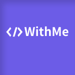

<div align="middle">

<a href="https://github.com/Team-WithMe" rel="noopener" target="_blank">
	
</a>

<h1>With Me UI</h1>

A With ME React Design System, powered by <a href="https://github.com/changyuyeo" rel="noopener" target="_blank">changyu</a>.

[](https://github.com/Team-WithMe/WithMe_UI/actions/workflows/ci.yml)


</div>

<br />

## Installation

npm

```
npm i @with-me/design @with-me/styles
```

yarn

```
yarn add @with-me/design @with-me/styles
```

<br />

## Usage

최상단 파일에 해당 style 들을 import 해주세요! (ex: App.tsx, \_app.tsx)

```tsx
import '@with-me/styles/build/global.css'; // 기본 설정 style
import '@with-me/styles/build/design.css'; // component의 style
```

<br />

스토리북을 참고해서 사용하시면 됩니다!

```tsx
import { Button } from '@with-me/design';

const App = () => <Button bgColor="primary">버튼</Button>;
```

<br />

### Next.js 에서 사용 시

next.config.js 에서 다음과 같이 설정해주세요!

```js
const withTM = require('next-transpile-modules')(['@with-me/design']);

/** @type {import('next').NextConfig} */
module.exports = withTM({ ... });
```

<br />

## CSS variables

- 실시간 커스텀마이징을 할 수 있도록 **css 사용자 정의 변수**를 제공합니다!
- with-me 의 모든 변수는 **wm-** 으로 시작합니다!
- `@with-me/styles/build/global.css` 가 적용된 곳이면 어디서나 접근하여 오버라이딩을 할 수 있습니다.

<br />

```css
/* 최상위 변수 */
:root {
	--wm-primary: #6c5ce7;
	--wm-primary-outline: #6c5ce727;
	--wm-secondary: #a29bfe;

	--wm-purple: #341f97;
	--wm-bluebell: #5f27cd;

	--wm-danger: #e74c3c;
	--wm-danger-outline: #e74c3c77;
	--wm-danger-bg: #fff8f6;
	--wm-success: #008a05;
	--wm-white: #fff;

	--wm-error-bg: #fff8f6;
	--wm-line-color: #f1f3f7;
	--wm-body-color: #222;
	--wm-body-bg: #f8f9fd;

	--wm-gray-100: #222;
	--wm-gray-200: #484848;
	--wm-gray-300: #717171;
	--wm-gray-400: #808080;
	--wm-gray-500: #aaa;
	--wm-gray-600: #b0b0b0;
	--wm-gray-700: #c4c4c4;
	--wm-gray-800: #ddd;
	--wm-gray-900: #ededed;

	--wm-body-font-family: 'Noto Sans KR', sans-serif;
}
```

<br />

## Links

- [github](https://github.com/Team-WithMe/WithMe_UI)
- [storybook](https://with-me-ui.netlify.app)
